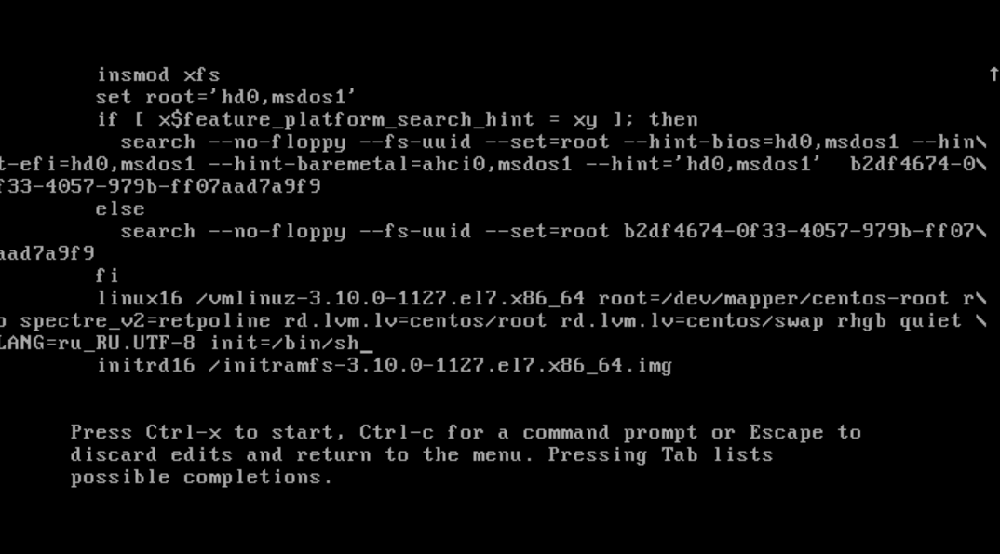
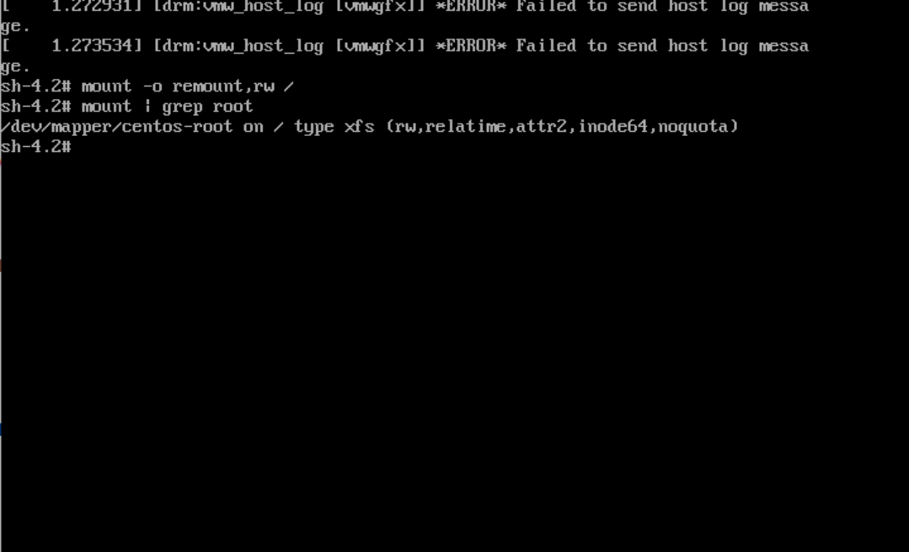
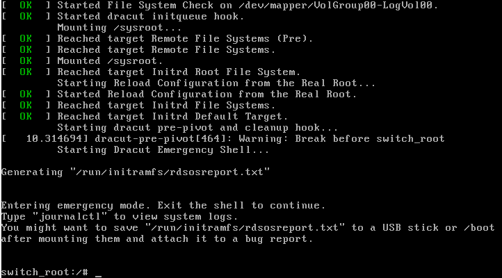

# **Попасть в систему без пароля**
## **Способ 1. init=/bin/sh**
### В конце строки начинающейся с linux16 добавляем init=/bin/sh и нажимаем сtrl-x для загрузки в систему

### Рутовая файловая система при этом монтируется в режиме Read-Only. Если вы хотите перемонтировать ее в режим Read-Write можно воспользоваться командой:
```
mount -o remount,rw /
```


## **Способ 2. rd.break**
### В конце строки начинающейся с linux16 добавляем rd.break и нажимаем сtrl-x для
загрузки в систему



```
mount -o remount,rw /sysroot
chroot /sysroot
    passwd root
    touch /.autorelabel
```

## **Способ 3. rw init=/sysroot/bin/sh**
### В строке начинающейся с linux16 заменяем ro на rw init=/sysroot/bin/sh и нажимаем сtrl-x
для загрузки в систему

# **Установить систему с LVM, после чего переименовать VG**
```
[root@lvm vagrant]# vgs
  VG         #PV #LV #SN Attr   VSize   VFree
  VolGroup00   1   2   0 wz--n- <38.97g    0
[root@lvm vagrant]#  vgrename VolGroup00 OtusRoot
  Volume group "VolGroup00" successfully renamed to "OtusRoot"
[root@lvm vagrant]# vi /etc/fstab
[root@lvm vagrant]# vi /etc/default/grub
[root@lvm vagrant]# vi /boot/grub2/grub.cfg
[root@lvm vagrant]#  mkinitrd -f -v /boot/initramfs-$(uname -r).img $(uname -r)
Executing: /usr/bin/dracut -f -v /boot/initramfs-3.10.0-862.2.3.el7.x86_64.img 3.10.0-862.2.3.el7.x86_64
...
...
*** Creating initramfs image file '/boot/initramfs-3.10.0-862.2.3.el7.x86_64.img' done ***
[root@lvm vagrant]# vgs
  VG       #PV #LV #SN Attr   VSize   VFree
  OtusRoot   1   2   0 wz--n- <38.97g    0 
```


# **Добавить модуль в initrd**
## Скрипты модулей хранятся в каталоге /usr/lib/dracut/modules.d/
```
[root@lvm 01test]# vi module-setub.sh
[root@lvm 01test]# vi test.sh
[root@lvm 01test]# mkinitrd -f -v /boot/initramfs-$(uname -r).img $(uname -r)
...


